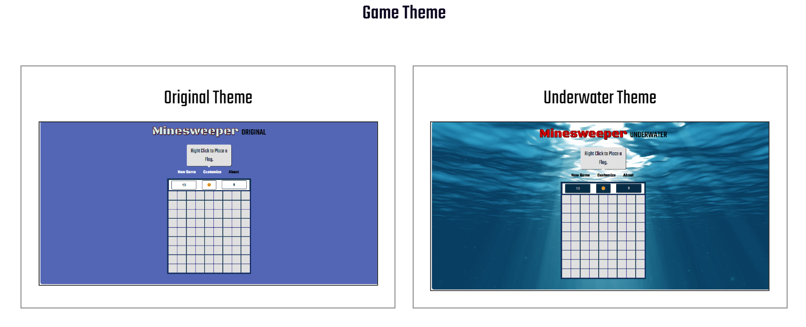

# Minesweeper

## Introduction

Minesweeper is a timeless strategic game that challenges players to navigate a grid filled with hidden "_mines_", The goal is to clear the board without detonating any mines.Throughout the game, players receive valuable clues, many tiles display numbers indicating how many mines are adjacent to them, helping to deduce safe moves. I chose to build Minesweeper for my project because it is one of my favorite games, and building it seemed challenging since it have many requirements.

## Game Features

- **Classic Gameplay:** You can enjoy the traditional Minesweeper experience with a grid of tiles and hidden mines.
  

- **User-Friendly Interface:** Intuitive design for easy navigation.

- **Multiple Difficulty Levels:** Choose from beginner, intermediate, and Advance levels to suit your skill.
  

- **The Timer:** the timer track your best times, which helps you challenge yourself to improve.

- **Customizable Settings:** you can Adjust the game theme to enhance your experience.
  

- for more information about the game, you can view the [about Page](https://innate-dime.surge.sh/about.html)

## Getting Started

### Prerequisites

To run the Minesweeper game, you'll need:

- An electronic devise (PC, Laptop, Smartphone)
- A modern web browser (Chrome, Firefox, Safari, etc.)
- To access the website: [Minesweeper-kn](https://innate-dime.surge.sh/index.html)

### How To Play

1. Click on a square to reveal it. If it's a mine, you lose the game.
2. If the square is safe, it will display a number indicating how many mines are adjacent to that square.
3. Use the numbers as clues to deduce where mines are located. For example, if a square shows "1", there is one mine in the adjacent squares.
4. Right-click (or long-press on mobile) to flag a square you suspect contains a mine.
5. Your goal is to reveal all non-mine squares without triggering any mines.

## User Stories

- As a user, I want to see a landing page when I arrive at the website, so I know I'm in the right place.

- As a user, I want instructions on how to play the Game.

- As a user, I want a clear button for difficulty levels.

- As a user, I want to be able to change the difficulty level anytime.

- As a user, I want a clear screen that display the number of Mines Remain

- As a user, I want a clear screen that display the timer

- As a user, I want to be able to click on one of the difficulty buttons, reset button, and Grid squares.

- As a user, I want the mine location to be random

- As a user, I want the numbers on the Grid to refers to the number of mines currently touching that number's square

- As a user, I want to see all the numbers surrounding an empty square after clicking it.

- As a user, I want an Emoji that gives feedback when I win, Loose, or place a flag.

- As a user, I want visual feedback after clicking Grid squares.

- As a user, I want to be able to place flags on areas I believe contain a mine.

- As a user, I want to see an empty square, or a number if I clicked on a safe square.

- As a user, I want to view all mine's locations if I loosed.

- As a user, I want to be presented with a clear message indicating that I won the game.

- As a user, I want to be able to reset the game whenever I want.

## Technologies used:

- **HTML (HyperText Markup Language):** HTML is used to create the Web pages, and structure the game's user interface. It provides the framework for the grid, navigation par buttons, and other interactive elements.

- **CSS (Cascading Style Sheets):** CSS discripe how HTML elements are displayed on screens. It was employed for styling the game, ensuring it is visually appealing and responsive.
- **JavaScript:** JavaScript is the world's most popular programming language It is the backbone of the game's functionality. It handles the game logic, including adjacent cells, tile revealing, mine placement, and win/loss conditions. This makes the game interactive and responsive to user actions.

- **Version Control System(Git):** Git is used for version control, and source code management. Git helps keeping track of code changes, and collaborate on code. Which ensures that the project can be maintained and updated efficiently.

- **GitHub:** GitHub is a web-based platform that uses Git to help developers manage and track changes in their code. It allows multiple people to collaborate on a project, track revisions, and contribute to code from anywhere in the world.

## Next steps:

In the future I will improve this game by adding more themes (Cyberpunk Theme, Jurassic Theme, etc), and other customization features. I will improve the game interface and add better sound effects, and animations. In addition to challenging playing modes.
I will add a database to the game for the players to view their best score, and compete against players from around the world.

## Attributions

- **[Pixabay:](https://pixabay.com/sound-effects/)** The source for Audio, and Sound Effects.

- **[Gamesver](https://www.gamesver.com/minesweeper-explained-how-to-play-rules/), [Minsweeper Wiki](http://www.minesweeper.info/wiki/Strategy), and [Wikipedia](<https://en.wikipedia.org/wiki/Minesweeper_(video_game)>)** Used to get more information's about the game

- **[W3schools:](https://www.w3schools.com/)** Used to help improve the design.

- **[Itsourcecode](https://itsourcecode.com/javascript-tutorial/how-to-create-minesweeper-in-javascript-with-sample-code/), and [Opengenus](https://iq.opengenus.org/minesweeper-game-using-js/)** Had a previous Minesweepers projects used as a reference.
