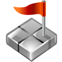

# Minesweeper

## Introduction

Minesweeper is a classic strategy game. The game feature a grid of clickable tiles, with hidden "_Mines_" scattered through the board. The objective of the game is to complete the board without denotating any mine. The game include clues about the mines locations, as most of the cells in the game grid has a number indicating the number of neighboring mines in each field. Variant of Minesweeper have been made that expand on the basic concepts, such as Minesweeper Online,_Minesweeper Arbiter_, _Minesweeper X_, and _Infinite Minesweeper_.

### Rules

Minesweeper rules are very simple. The board is divided into cells, with mines randomly distributed. To win, you need to open all the safe cells. The number on a cell shows the number of mines adjacent to it. Using this information, you can determine whether the cells are safe, or contain mines. Cells suspected of being mines can be marked with a flag using the right mouse button.

## Getting Started

## Attributions

## Technologies used:

## Next steps:

## User Stories

- As a user, I want to see a landing page when I arrive at the website, so I know I'm in the right place.

- As a user, I want instructions on how to play the Game.

- As a user, I want a clear button for difficulty levels.

- As a user, I want to be able to change the difficulty level anytime.

- As a user, I want a clear screen that display the number of Mines Remain

- As a user, I want a clear screen that display the timer

- As a user, I want to be able to click on one of the difficulty buttons, reset button, and Grid squares.

- As a user, I want the mine location to be random

- As a user, I want the numbers on the Grid to refers to the number of mines currently touching that number's square

- As a user, I want to see all the numbers surrounding an empty square after clicking it.

- As a user, I want an Emoji that gives feedback to every click I make.

- As a user, I want visual feedback after clicking Grid squares.

- As a user, I want to be able to place flags on areas I believe contain a mine.

- As a user, I want to see a number if I clicked on a safe square.

- As a user, I want to view the mines’ location if I loosed.

- As a user, I want to be presented with a clear message indicating that I won the game.

- As a user, I want to be able to reset the game whenever I want.

## Pseudocode

### Define the required constants:

// I will create a constant emojis object that contain all the emojis necessary for the game
// I will create an object named gridSettings, that contain the total number of mines, numbers of rows, and columns in the Grid,

// Define any variables used to track the state of the game:

// for the stopwatch, I will create variables:
// a second variable that increase as the time pass
// a variable called timer, that can have the value of true (when the stopwatch starts), or false (when the stopwatch stops)

// I will create a boolean variable named gameStart, it will return true if the game start, and false if not.

// I will create a boolean variable named GameEnd, it will return true if the user win, or lose.

// I will create a variable named gameDifficulty that contain three different values, such as ‘Beginner’, ‘Intermediate’, ‘Advance’

//I will create a variable named RemainingMines, it will calculate the number of mines remain

//I will create a variable named Grid, it will contain the whole grid, containing mines, numbers, and empty squares.

### Cached Element References

// I will create an element reference to the left textbox above the game grid, that contains the mine remaining on the grid.

// I will create an element reference to the right textbox above the game grid, that contains the stopwatch

// I will create an element reference to the button above the game grid, that contain the emoji, and reset button.

// I will create an element reference to the grid

### Functions:

// I will make a function called startStopwatch, that will count the time the player takes to win or lose the game.
// I will make a function called stopStopwach, that will stop the stopwatch when the player wins, or loose.

// I will create a function called startGame, that will create the grid using my global variables, and reset both the game timer, and the remainingMine variables.
// I will create a function called renderGrid, that updates the visual representation of the game grid, using the difficulty variable.
// I will create a function called generateMines, that generates mines in random locations inside the grid

// I will create a function called handleClick, that handles the player clicks, it will check if the player clicked on a number, empty square, or a mine.

// I will create a function called gameOver, that will work in case the player loose. The function will stop the timer, change the emoji, and will reveal the Mines locations
// I will create a function named setSquareAttribute, that will give the grid square a class named mine if it contains mine, class named empty if the square is null.

//I will create a function called calculateMineNear, that will loop over the squares with mine attribute, it will increase the value of the squares surrounding it.

// I will create a function called displayArroundEmpty, that will display the empty square and the area around it, this will stop when the square has number

// I will create a function called reset, that will reset the game variables

// I will create a function called handleEmojis, this function will change the emoji in the button depending on player click, win, or loose

// I will create a function called placeFlag, that will place a flag emoji when the user right clicks the grid square. It also decreases the number of remainingMine variable

// I will create a function called playerWin, that will work in case the player. It will stop the timer and change the button emoji.

### Event listener

//I will create an event listener that activates the handleClick function if the user clicked on the grid square.

// I will create an event listener that activates the reset function when the userclicksk on the button emoji.

// I will create an event listener that activate the placeFlag function when the user right click on a grid square.
